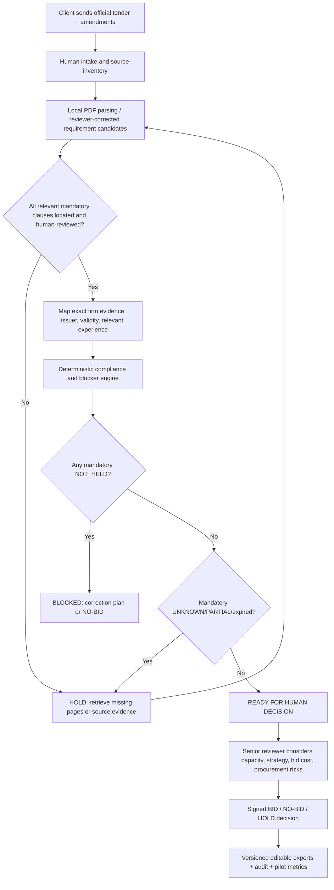
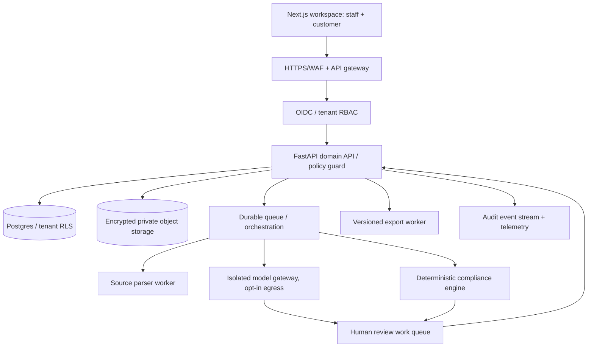

# TenderOS: Production-Ready Company Blueprint and Verified Local MVP

**Specification**: 1.0 | **Prepared**: 9 October 2026 | **Status**: local prototype implemented; commercial assumptions and production design require validation and approval.  
**Owner / positioning**: IP3 Consulting Limited / TenderOS (TenderToFit product lineage).  
**Product category**: Bid Decision Intelligence for professional consulting organizations, not AI-generated bid submissions.

> Truth hierarchy: official tender source → human-reviewed requirement with quotation/provenance → verified organization evidence → documented human commercial judgment → derived output. No generated narrative can outrank its sources.

## 1. Actual functioning deliverable (MVP 0.1)

**What is implemented now**

| Component | API / functionality | Status |
|---|---|---|
| Assessments | Organization + tender intake, notice ID, buyer, deadline, source URL metadata | Built/tested |
| PDF intake | Local text PDF read, SHA-256 provenance, candidate lines by page; 10 MB and 150-page caps | Built/tested, heuristic |
| Requirement validation | Review/edit original clause and mandatory classification | Built/tested |
| Evidence vault (references only) | Register organization evidence document reference, validity and human verification note | Built/tested |
| Deterministic judge | Mandatory NOT_HELD blocks; UNKNOWN / PARTIAL / unreviewed / expired / weak provenance withholds BID | Built/tested |
| Source coverage attestation | Named reviewer confirms full source inventory including annexes and amendments; fingerprint becomes stale when requirements/sources change | Built/tested, **self-asserted** |
| Review gate | BID / NO-BID / HOLD signed by named operator; API refuses premature BID | Built/tested, **not authenticated** |
| Export center | Editable DOCX, XLSX, CSV with sources and status; decision history | Built/tested |
| Audit / revision awareness | Event log, source hashes, decision snapshot fingerprint; stale previous decisions identified | Built/tested, **local-only** |
| Commercial validation | Quoted amount vs paid amount, time/cost, repeat purchase and generic AI + Excel benchmark | Built/tested |
| Multi-tenant secure SaaS | OIDC, roles, RLS, encryption, queues, safe agent integrations | **Design only** |
| Actual LLM agents | Retrieval-bound extraction and evidence matching; sandbox model gateway | **Design only** |
| Automatic discovery, submission, proposal writing, financing | Explicitly outside paid-pilot scope | **Not implemented** |

**Run**: in repository root `pip install -r requirements.txt` then `uvicorn app.main:app --host 127.0.0.1 --port 8000`. Open `http://127.0.0.1:8000`. Use `pytest -q` for repeatable tests. Work is local-only: no identity verification, no certified security posture, no connected client portals.

### Realistic boundary conditions

1. This MVP creates **candidate requirements**, not a complete extraction. Tables, annexes, special clauses, scans, and errata can be missed. Review against the complete original documents; manually register omitted mandatory clauses.
2. An evidence 'verified' label is a **human assertion** with a note. The current software cannot authenticate the document issuer or check government procurement records.
3. A readiness percentage is the share of mandatory conditions with verified evidence, **not a bid success probability**; a blocker overrides it.
4. A `BID` is an approval to proceed with bid preparation, **not certification of legal eligibility, procurement award likelihood, or tender submission**.
5. Local person names and roles are not authenticated; append-only API logs do not prevent direct alteration by someone with filesystem/database access.
6. Production go-live requires security and customer validation gates below; **do not deploy local MVP as a public server**.

## 2. Target customer, problem, and initial offer

**Primary ICP**: Bangladesh consulting firms, technical advisory organizations, survey/M&E providers, and eligible service providers submitting roughly four or more tenders each year but lacking a large dedicated bid-compliance team. Start with sectors where the owner has genuine domain knowledge, especially development-finance, economic/financial feasibility, evaluation, climate, education and surveys.

**Problem**: staff incur substantial unrecoverable bid-preparation costs before they have verified legal/technical/commercial eligibility. Requirements are fragmented across notices, RFPs, addenda, eligibility schedules, forms and project references. A generic text summarizer is not an evidence-backed disqualification check.

**Initial offer: '48-Hour Tender Readiness Diagnostic'** (48 hours is a service objective after complete documents are received, not a software SLA).

- Intake of official tender and amendments, organization profile and documentary proof.
- Official-source requirement register with verbatim excerpts and page/section locations.
- Mandatory/optional classification and compliance matrix with reviewer sign-off.
- Document validity, relevant experience and staffing evidence gaps.
- BID / NO-BID / HOLD recommendation **approved by a human**, plus prioritized corrective actions.
- DOCX/XLSX report and optional follow-up review call.

**Explicit initial exclusions**: proposals drafted automatically, unsolicited tender scraping/discovery, e-GP account access, bid submission, invoicing/payment rails held by TenderOS, financing/guarantees and consortium brokerage. Those require separate scope and evidence gates after repeat paid traction.

**Product thesis**: sell the reduction in avoidable bidding mistakes and effort first; improve software with paid actual-use evidence. Software is the production system for a managed expert service. Managed service remains an acceptable outcome if buyers repeatedly pay for it.

## 3. The first customer journey and workflow



### Additional fail-closed source gate

The human domain reviewer must explicitly attest the completeness of the source inventory after checking the full available RFP, annexes, schedules and known addenda. The attestation is version-bound to the source/requirement inventory. Adding or editing source clauses revokes it. Without a current attestation, a BID is refused even if every *entered* mandatory clause has supporting evidence. This mitigates but cannot guarantee against omitted clauses.

### Status policy (deterministic, no LLM override)

| Requirement condition | Internal status | Outcome |
|---|---|---|
| Explicitly mandatory, confirmed not held | NOT_HELD | BLOCKED; BID denied |
| Mandatory, absent/partial/unverified/expired supporting evidence | UNKNOWN/PARTIAL | UNRESOLVED; BID denied |
| Human has not classified requirement or verified source quote | UNREVIEWED | UNRESOLVED; BID denied |
| Mandatory, reviewed source + linked human-verified current evidence | VERIFIED | Can count toward readiness; final human gate still applies |
| Reviewed optional condition is unresolved | UNKNOWN/PARTIAL | Flag action/risk; mandatory gate may still proceed |
| Changes/addenda after previous decision | STALE_DECISION | Reopen human review; previous approval cannot be treated as current |

**Other human commercial questions**: actual proposal budget, project profitability, capacity, delivery timeline, independence/conflicts of interest, bid security, partner dependencies, project fit, and opportunity cost. These are transparent business judgments, **not inferred win rates**.

## 4. AI-native company organization

**Minimum human structure initially**: Founder/Managing Director (commercial risk and pricing), one procurement/domain reviewer (can initially be the founder), one implementation engineer (part-time or project contract), and professional accounting/legal/security support as needed. The objective is low fixed headcount, not an unsupported claim of zero human work.

**Agents in future supervised stack** — names denote bounded capabilities, not full-time staff equivalents.

| Unit / agent | Input | Allowed tasks | Output | Hard boundary |
|---|---|---|---|---|
| COO / Workflow Orchestrator | Work order + stage | Schedule state transitions, allocate bounded tasks, stop on uncertainty | Audit-linked job trace | Cannot override policy/approval gates |
| A1 Source Integrity | Tender, addenda, exact URLs/files | Hash, deduplicate, inventory versions | Source register + mismatch flags | Cannot claim an unofficial file is authoritative |
| A2 Requirement Extractor | Allowlisted document chunks | Suggest exact clauses, preserve page/quote spans | Unreviewed candidate requirements | Cannot classify eligibility conclusively |
| A3 Requirement Normalizer | Reviewed candidates | Propose category, threshold, dependency | Versioned normalized clause | No silent merge/split or deletion |
| A4 Evidence Matcher | Tenant-owned CVs, contract proof, certificates | Suggest possible evidence links and contradictions | Candidate evidence claims | Cannot label proof 'verified' |
| A5 Deterministic Compliance | Reviewed statuses + verified claims | Apply hard blocker and readiness rules | Machine-readable blockers | No generative LLM decision authority |
| A6 Commercial Analyst | Human-provided cost/capacity assumptions | Scenario analysis, opportunity cost | Decision brief with assumptions | No invented win probability or financial forecast |
| A7 QA / Red Team | All artifacts with source references | Detect missing citations, changed annexes, contradictions | Findings and HOLD recommendations | Does not independently approve BID |
| A8 Document Publisher | Human-approved snapshot | Assemble editable Word/Excel reports | Versioned output with citations | No outbound mail without authorization |
| A9 Growth Analyst | **Consented** paid-pilot records | Analyze retention, margin and segment economics | Management metrics | No unattended marketing or client data disclosure |

**Start with a deterministic 'agent' system**: software workers + retrieval + rules; switch on models only when golden-set evaluations demonstrate that they reduce reviewer time without unacceptable missed blockers.

### Agent contract

Every invocation must include `tenant_id`, `assessment_id`, `run_id`, `tool_allowlist`, `source_ids`, `input_sha256`, `budget_limit`, `deadline`, `model_version`, `prompt_version`, and `output_schema`. Each output has `claims[]` with `source_span_ids`, `uncertainty`, `review_required`, and `quality_flags`. An agent cannot mark itself as its own independent verifier. Limit max tool calls, retries, tokens, and monetary spend per job; use idempotency keys and explicit escalation. Sanitize tender text as **untrusted data** (malicious RFP instructions cannot change the agent's system permissions).

## 5. Production reference architecture



**Production stack choice**: Next.js + TypeScript (UI), FastAPI + Python/Pydantic (domain/API), Postgres (including tenant key / row-level security), S3-compatible object storage (source PDF and evidence), Redis or equivalent job queue, Temporal for durable multi-stage jobs if operationally justified, and a pluggable LLM adapter behind a model gateway. `pgvector` / hybrid keyword search only when evidence retrieval benchmarks justify its complexity. Use `python-docx` and `openpyxl` for editable reports, `pypdf` for local text extraction, and carefully validated OCR only through explicitly approved processing. Monitoring: OpenTelemetry traces plus an audit/event log, with model-evaluation tooling such as Langfuse if allowed by privacy review.

**Why not many agents in release 1?** Each extra agent multiplies failure modes, latency and review ambiguity without demonstrated marginal return. Domain events can be consumed by simple deterministic workers first; upgrade bounded tasks to LLM-assisted agents only after validation.

**Versioning/integrity**: retain an immutable original source hash, individual source revisions/addenda, review snapshots, reviewer identity and final decision fingerprints. New amendments and evidence expiry invalidate the active approval while preserving historical decisions.

### Public API contract (production proposal)

- `POST /v1/organizations` (admin only); `POST /v1/assessments` (create project, source metadata).
- `POST /v1/assessments/{id}/documents` (private upload and quarantine, versioned).
- `POST /v1/assessments/{id}/extractions` (versioned unreviewed candidates, async job).
- `PATCH /v1/requirements/{id}` (source-linked corrections; only qualified reviewer can confirm).
- `POST /v1/evidence` + `POST /v1/requirements/{id}/claims` (link and verify specific proof).
- `GET /v1/assessments/{id}/compliance` (deterministic, testable readiness state).
- `POST /v1/assessments/{id}/approvals` (role-verified approval, snapshot hash, reason).
- `GET /v1/assessments/{id}/exports` (versioned outputs via short-lived signed links).
- `GET /v1/assessments/{id}/audit` (tenant-scoped immutable history).
- `POST /v1/pilots/{id}/observations` (paid-pilot and comparator measurements).

Idempotency for writes, optimistic version locking, pagination, rate limits, predictable 4xx errors, and per-request audit correlation are mandatory prior to external launch.

## 6. Production data model

The local MVP includes seven base business tables: `organizations`, `tenders`, `sources`, `requirements`, `evidence`, `decisions`, plus `audit_events` and `pilot_metrics` (eight in total). Stored PDF originals are private filesystem blobs; the database has one requirement record per clause, with one linked evidence reference. This is intentionally narrow. Do not pretend it is a completed multi-tenant enterprise model.

**Production target schema (key objects and fields):**

| Table | Important fields | Constraints |
|---|---|---|
| `tenants` | id, legal_name, region, billing_status, data_policy | Tenant root; status checks |
| `users` | id, oidc_subject, email, mfa_state | Independent authentication |
| `memberships` | tenant_id, user_id, role, active | Unique tenant-user; RBAC |
| `assessments` | id, tenant_id, organization_id, buyer, deadline, status, current_version | Version lock, tenant FK |
| `source_documents` | id, tenant_id, assessment_id, source_type, issuer, object_key, sha256, version, uploaded_by | Encrypted object; source chain |
| `source_spans` | id, source_id, page, section, quote, char_offsets, extractor_version | Exact provenance, immutable source link |
| `requirements` | id, tenant_id, assessment_id, source_span_id, normalized_text, category, is_mandatory, reviewer_id, review_version | Tri-state classification until reviewed |
| `requirement_revisions` | id, requirement_id, before, after, reviewer_id, at | No silent clause overwrite |
| `evidence_documents` | id, tenant_id, organization_id, source, expiry, status, document_hash | Private, versioned |
| `evidence_claims` | id, requirement_id, evidence_id, relevance_span, status, verified_by, verified_at | Many-to-many; verified assertion |
| `blockers` | id, requirement_id, rule_id, reason, severity, resolved_at | Derived from policy, not model |
| `decisions` | id, assessment_id, decision, snapshot_hash, approved_by, at, rationale, superseded_at | Approval is snapshot-specific |
| `agent_runs` | id, tenant_id, tool_scope, input_hash, model/prompt_version, output_hash, costs, status | Explainability and budget limits |
| `approval_requests` | id, tenant_id, action, risk_level, initiator, approver, state, expires_at | Human gate separate from worker |
| `audit_events` | id, tenant_id, actor_id, action, resource_id, before/after hashes, timestamp | Append-only/WORM target |
| `pilot_observations` | tenant_id, customer_id, invoice_reference, paid_amount, effort, decision_changed, repeat | Commercial evidence |
| `subscriptions` / `invoices` | tenant_id, plan, seats, usage, external_payment_reference | No custody of bid/contract funds |

**Essential production DDL concept**:

```sql
CREATE TABLE memberships (
 tenant_id uuid NOT NULL REFERENCES tenants(id),
 user_id uuid NOT NULL REFERENCES users(id),
 role text NOT NULL CHECK (role IN ('owner','analyst','reviewer','auditor','client_readonly')),
 active boolean NOT NULL DEFAULT true,
 PRIMARY KEY (tenant_id,user_id)
);

CREATE TABLE decisions (
 id uuid PRIMARY KEY,
 tenant_id uuid NOT NULL REFERENCES tenants(id),
 assessment_id uuid NOT NULL,
 decision text NOT NULL CHECK (decision IN ('BID','NO_BID','HOLD')),
 snapshot_hash char(64) NOT NULL,
 approved_by uuid NOT NULL REFERENCES users(id),
 rationale text NOT NULL,
 created_at timestamptz NOT NULL DEFAULT now(),
 superseded_at timestamptz
);
-- Complete migration must use composite tenant-safe foreign keys,
-- and tenant RLS policies verified under real non-superuser DB sessions.
```

**Multi-tenant design invariants**: every tenant-owned table contains `tenant_id`; API derives this from the authenticated session rather than trusting the body; Postgres RLS is defense in depth; object keys are not enumerable; test all cross-tenant read/write/export cases; use separate tenant encryption keys and dedicated deployments for sensitive clients when commercially justified.

## 7. Governance, agent boundaries and human-approval system

| Gate | Example operations | Agent authority | Required human control |
|---|---|---|---|
| G0 — routine/reversible | De-dup, format, queue, classify *unreviewed* suggestions | Allowed within scoped task | Post-hoc QA and audit |
| G1 — evidence review | Accept interpreted eligibility condition; mark document verified | Suggestions only | Qualified domain reviewer |
| G2 — consequential business | BID/NO-BID, fee quote, compliance exception, source override | Prohibited from final action | Named senior reviewer / dual sign-off where risk warrants |
| G3 — external or irreversible | Customer data sharing with model, sending proposal, making payment, portal login/submission, production rollout | No autonomous action | Explicit owner authorization, access review and security gate |

**TypeSafe-style evaluation**: separate observed facts, source excerpts, model inferences, and assumptions in both the database and user interface. For ambiguous, contradictory or poorly evidenced matters, choose `HOLD`/`UNKNOWN`, request stronger sources, or escalate. Override paths must preserve the prior source and rationale. Scope, policy and agent configurations are versioned and controlled. Critical procurement requirements **must be checked against current official rules before operating in a live jurisdiction**.

## 8. Threat model and security requirements

| Threat | Required response before real multi-user go-live |
|---|---|
| Confidential CVs and contract proof leak to third-party LLM | Provider DPA and policy review, explicit opt-in, redaction, zero default outbound egress, local model alternative |
| Prompt injection hidden in tender PDFs | Treat PDF contents as untrusted, isolate tool/model permissions, structured output, prohibit document text from issuing commands |
| Data stolen between customers | OIDC/SSO, MFA for privileged roles, tenant/RLS tests, authorization on every export and object access |
| Malicious PDFs, decompression attacks, exploits | File type/magic verification, size/page limits, AV scan, sandboxed parser, dependency/CVE pipeline |
| Falsified document evidence | Verification checklist, document/issuer reference, reviewer identity, source hash, approval log |
| Model hallucination or annex omissions | Source citation coverage, golden benchmark, explicit missed-clause test, independent reviewer |
| Incorrect BID after changed addendum/expired certificate | Recompute state from current versions; invalidate historical approval fingerprint |
| Insider tampering / audit deletion | Database privilege separation, append-only storage target, signed audit chain and tested backups |
| Model cost overrun | Per-assessment cost ceiling, rate limits, token/tool budgets, cancellation and anomaly alert |
| Regulatory and procurement change | Official-source monitoring and counsel/domain reviewer sign-off; no reliance on unverified policy translations |

**Minimum production controls**: TLS 1.2+, secret manager, encryption at rest, backup encryption, retention/deletion policy, restore drills, least-privilege service identities, WAF/rate limits, structured security logging, incident handling, vulnerability scanning, dependency pinning, privacy impact assessment and service contracts. The source-citation and prompt-injection defenses are as important as perimeter controls.

**Local MVP limits**: SQLite unencrypted at rest, local user identity self-asserted, no auth, no malware scanner, no encrypted object vault, no multi-user collaboration, no private data processing agreement. Keep it on an access-controlled workstation; do not expose via public tunneling.

## 9. Revenue model and sales motion

### Offer ladder (all prices below are hypotheses, **not validated market quotations**)

| Stage | Offer | Pricing experiment | Charging logic |
|---|---|---|---|
| Pilot / service-first | 48-Hour Tender Readiness Diagnostic | **BDT 15,000–25,000** per accepted assessment | Fixed scope, up to pre-agreed page/annex allowance |
| Pilot retainer, only after repeat demand | Monthly review hours + evidence refresh | BDT 20,000–60,000/month | Capped assessments/hours; overages at approved rates |
| SaaS after validated renewals | Workspace + seats + usage | Experiment with BDT 12,000–35,000/month plus assessments | Per-organization base + monitored storage/doc usage |
| Enterprise after security gates | Private tenant, SSO, integrations and SLA | Custom assessed pricing | Procurement/security review, minimum contractual commitment |

**Commercial funnel**: founder-led outreach to a small defined cohort of consulting firms → gather anonymized example and existing workflow cost → demonstrate one comparable assessment → offer a **paid** time-boxed diagnosis → deliver with traceable outcome → request repeat paid order → only then attempt subscription or channel partnerships.

**What makes this defensible**: verified requirement-to-proof mappings, change detection, audit and reviewer workflow, organization evidence reuse, jurisdiction-specific source provenance and historical *observable* value. Pure PDF summarization and generic LLM wrappers are unlikely to be sufficient differentiation.

**Commercial questions requiring direct interviews**: frequency of eligible bids; total proposal-preparation effort; cost of a false positive/negative qualification assessment; confidentiality willingness; willingness to pay for an expert-reviewed report; whether an organization will buy a second report; and whether in-house staff or generic AI + Excel is materially cheaper/faster for equivalent quality.

## 10. Costs and unit economics — explicit planning scenarios

The local software can run without paid AI APIs. It does **not** make reviewer labour free. These figures are deliberate illustrative planning inputs, not vendor quotations or realized unit economics.

### Per-diagnostic example (BDT)

| Item | Assumption | Per order |
|---|---|---:|
| Price charged | Fixed illustrative quote | **20,000** |
| Analyst extraction / mapping | 2 hours × 1,200 | 2,400 |
| Senior QA + decision review | 2 hours × 1,800 | 3,600 |
| Delivery/admin | 1 hour × 1,000 | 1,000 |
| Infrastructure, printing/communication allocation | Placeholder | 500 |
| Payment/collection and other direct costs | Placeholder | 300 |
| **Total estimated direct cost** | | **7,800** |
| **Contribution before fixed overhead, tax and acquisition** | 20,000 − 7,800 | **12,200 (61%)** |

**Monthly example** assuming fixed overhead of BDT 40,000 and the same mix; customer-acquisition and tax excluded:

| Paid diagnostics/month | Revenue | Total direct cost | Contribution | Less fixed overhead | Illustrative pre-tax operating result |
|---:|---:|---:|---:|---:|---:|
| 2 | 40,000 | 15,600 | 24,400 | 40,000 | **−15,600** |
| 5 | 100,000 | 39,000 | 61,000 | 40,000 | **21,000** |
| 10 | 200,000 | 78,000 | 122,000 | 40,000 | **82,000** |

Break-even at these assumed inputs is the **fourth paid assessment/month** (`40,000 / 12,200 = 3.28`, rounded up). Actual labor time may be much higher, especially for long, complex RFPs. Document time and payment for every pilot before relying on this model. These numbers do **not** establish 90% margins.

### Engineering and infrastructure budgeting (planning allowances, not price quotes)

| Cost center | Early local pilot | Secure managed SaaS after approval |
|---|---|---|
| Hosting | Existing workstation, minimal incremental cash cost | BDT 15k–60k/month allowance for API, DB, logs, encrypted file storage, backups |
| AI inference | **Zero** if model-free | Budget/cap per document; first scenario BDT 0–15k/month, evaluate actual token prices/provider policies |
| Development | Owner/contract time, measured separately | Approx. 40–80 engineer-days for core hardening, tenant auth, secure file handling, migration, evaluations and CI/CD; quote locally |
| Quality / procurement review | Human-hours per report (above) | Human-hours remain a variable cost unless demonstrated otherwise |
| Compliance/legal/accounting | Specific to customer procurement and business structure | Obtain external, jurisdiction-specific quotations |
| Incident response and security | Not covered by local prototype | Budget penetration test / vulnerability response / backups and restores prior to paying external customers |

**Budget guardrails**: per-document cost ceiling; model must never retry indefinitely; anonymization and file retention scoped by contract; no production build spend until repeat paid traction demonstrates a defensible path to recovery.

## 11. Commercial pilot design and evidence gates

Recruit ten carefully targeted organizations **as a recruitment objective**, not as evidence of existing demand. Seek 3–5 paid diagnostics within the first controlled pilot; track losses and failure reasons as carefully as successes. Use paired benchmarks on the same tender with generic AI + Excel under the same review protocol.

### Required observations per assessment

- Actual amount **collected** (distinguish quote, invoice, paid), payment reference and collection date.
- Opportunity and customer type, tender size/complexity, confidentiality restrictions.
- Baseline manual assessment time versus TenderOS analyst + QA elapsed effort.
- Requirement recall on a reviewer-maintained gold-standard source inventory (including annexes and amendments).
- Mandatory false-clearance count (**target 0 in evaluated cases; not proof that unseen errors cannot occur**).
- Number of material qualification risks discovered that alternative workflow missed.
- Was client's pursue/not-pursue decision changed or materially protected?
- Customer returned with another **paid** assessment and at what real price?
- Complaints, corrections, rework, and turnaround time.

### Go / hold / pivot triggers

- **Go to secure multi-tenant build** only with repeat actual payments from independent customers, reviewer-verified accuracy, useful differentiated outcomes, acceptable costs and signed privacy/processing agreements.
- **Hold** if extracts or evidence checks miss critical conditions, external provider privacy is unresolved, client onboarding is excessive, or audit/tenant isolation is unverified.
- **Pivot to managed service** if clients repeatedly pay for expert decisions but not self-serve software. That is a legitimate commercial outcome.
- **Stop/reshape** if generic AI + Excel plus ordinary reviewer effort delivers comparable value, if willingness to pay is insufficient, or if procurement regimes make the service unworkable.

## 12. Phased implementation and release gate schedule

| Period | Deliverables | Release evidence and go/no-go |
|---|---|---|
| **Now / Week 0** | Local MVP 0.1, synthetic test tender, 9 automated tests, editable exports | Local testing only; no real-client remote access |
| **Weeks 1–2: instrumented service** | Source review SOP, reviewer rubric, eligibility checklist, client consent, priced scope and 48h service playbook | Independently review two representative real historical tenders against full source/annexes; resolve extraction gaps |
| **Weeks 3–6: paid pilots** | Founder-led selling, 3–5 paid orders target, time sheets, generic AI + Excel comparison, corrected errors | Repeat willingness-to-pay signal, reliable gate, measured contribution per diagnostic |
| **Weeks 7–10: security hardening if gates pass** | OIDC, tenant roles, RLS, encrypted object storage, backups, isolated parser, secure upload and deletion | Negative IDOR/tenant tests, restore drill, penetration review, external data approval |
| **Weeks 11–14: bounded AI agent pilot** | Opt-in source-extraction/evidence suggestion workers, schema validation, evaluation harness, budgets and source quotes | Golden corpus evaluation, regression and red-team checks, human reviewer no worse off |
| **Months 4–6: small SaaS beta** | Customer tenant portal, versioned reports, amendment awareness, retention and billing workflow | Paid repeat/renewal, SLA and incident process, supported real customer usage |
| **Only later** | Tender alerts, controlled integrations, bid assembly, post-award proof and broader verticals | Separate market, regulatory, policy, privacy and financial gates |

### Technical acceptance / test expansion before production

- Correctly reject unauthorized tenant cross-access across **every** API, export, file and audit route.
- Source documents, amendments and reviewer changes preserve exact versioned citations.
- Reviewers can inspect and correct any model-proposed extracted requirement.
- Mandatory NOT_HELD and UNVERIFIED/PARTIAL/UNKNOWN rules are deterministic and have unit/property tests.
- Source changes or expired evidence invalidate an active BID without erasing the earlier decision.
- Word and Excel reflect the same immutable approved snapshot, not mismatched live states.
- Validation uses independent held-out local procurement examples and adversarial instructions embedded in documents.
- Test database restore, file object restore, worker retries, OCR failure, timeouts, high page counts and payment/metric reconciliation.
- Deploy via audited CI/CD, environment-specific secrets, security gates and documented rollback.
- Current official e-GP and donor procurement rules are confirmed by qualified professionals; neither model inference nor translated/older sources are assumed current.

## 13. Management dashboard KPIs

**Commercial**: paid diagnostics, actually collected BDT, second paid assessment rate, customer acquisition cost (CAC), time to cash, realized contribution per diagnostic, revenue by sector, accepted vs declined quote ratio.

**Operational**: median reviewer hours, turnaround time, extraction coverage, rework count, unresolved clauses, evidence expiry issues, benchmark time savings, client retention.

**Risk**: incorrect mandatory clearance (high-severity incident), unreviewed source references, outdated decisions, data-access anomalies, external LLM egress by tenant, cost-limit breach, audit and backup health.

**Agents**: tool-call success rate, average cost per assessment, retrieval provenance coverage, missed-condition rate, reviewer correction rate, exception escalation rate. *Do not reward agents solely for speed or confidence*.

## 14. First management decisions required

1. Approve **48-Hour Tender Readiness Diagnostic** as the only monetized first offer and authorize a controlled service pilot.
2. Approve market-facing scope, customer confidentiality language, pricing range as an experiment, reviewer sign-off policy, and operating budget ceiling.
3. Select initial target vertical (development consultancy recommended given founder expertise) and ten qualified organizations for outreach.
4. Nominate a real human domain reviewer distinct from the extraction preparer where possible.
5. After paid pilot, use measured data to decide whether to invest in hosted SaaS and which bounded model agent actually improves results.

---

## Provenance and verification status

This blueprint continues the user-established TenderToFit / APES governance and scope rules. Details of **current e-GP/legal eligibility**, active tender feeds, current vendor pricing and procurement rules were **not verified by live web search** and must not be treated as authoritative. No market-demand, realized margin or production security claims have been made. The implemented repository and tests are verifiable locally; a production deployment, model integrations, and customer acceptance have not occurred.
